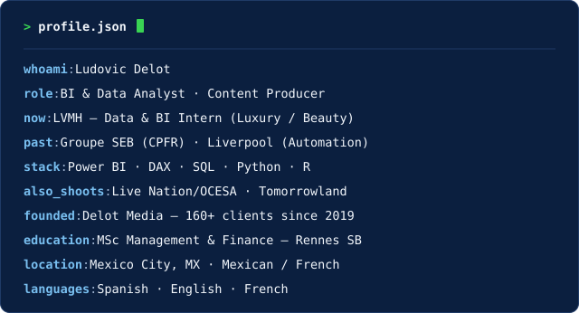

<h3><code>ludo@github ~ $ ./contributions.sh</code></h3>

  

<h3><code>ludo@github ~ $ whoami</code></h3>
<table>
  <tr>
    <td valign="top"></td>
    <td valign="top"></td>
  </tr>
</table>

 

---

### 🧭 What I actually do

Business Intelligence & Data Analyst by trade — currently **Data & BI Intern at LVMH**, where I scaled a reporting product from 4 to 20+ Power BI dashboards on a 25-table data model, standardizing KPIs across Marketing, Commercial, Finance and IT. Before that: CPFR forecasting across 25,000+ SKU-store combinations at **Groupe SEB**, and automation ROI evaluation at **El Puerto de Liverpool**.

The other half runs on cameras, not spreadsheets — festival photography for **Live Nation/OCESA** (Vive Latino, Festival Arre), Content Marketing Producer for **Tomorrowland's Lab of Tomorrow**, and my own studio, **Delot Media**, since 2019.

### 🚀 Featured projects

| Repo | What it is |
|---|---|
| [rsb-datascience-finance-clustering-portfolios](https://github.com/ludodelot/rsb-datascience-finance-clustering-portfolios) | K-Means & hierarchical clustering across 105 US stocks to build portfolios — no forecasting involved |
| [rsb-financial-econometrics-semiconductors](https://github.com/ludodelot/rsb-financial-econometrics-semiconductors) | PCA, robust OLS, CSAD herding test & EGARCH on the semiconductor supply chain |
| [rsb-exchange-markets-ppp-mexico-france](https://github.com/ludodelot/rsb-exchange-markets-ppp-mexico-france) | Testing (and rejecting) Purchasing Power Parity between Mexico and France, 2020–2024 |
| [rsb-financial-toolbox-easyvelo](https://github.com/ludodelot/rsb-financial-toolbox-easyvelo) | Full financial model (P&L, WACC, break-even) for a bike-subscription business plan |

### 🛠️ Stack

Heatmap refreshes daily via GitHub Actions — no token, no third-party stats service, just a public contribution calendar scrape and a hand-rolled SVG. Portrait and info card are static SVGs generated once from <code>scripts/</code>.
